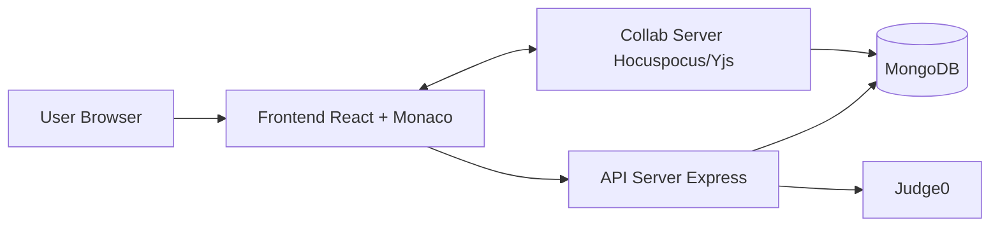
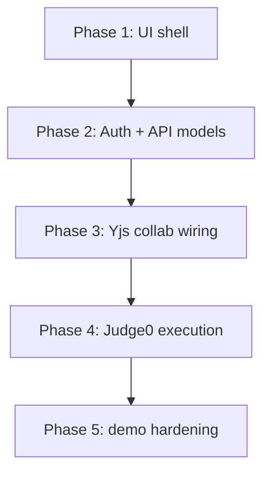

# MultiCoder Build Blueprint

## 1) System Lens



## 2) Layer Responsibilities

- **UI shell:** VS Code-like ergonomics (explorer, tabs, editor, output panel).
- **Real-time sync:** file-level Yjs docs over WebSocket rooms.
- **Execution:** backend-mediated Judge0 sandbox run flow.
- **Persistence:** MongoDB for users/projects/files/sessions/collaborators.

## 3) Build Sequence (Recommended)



## 4) Folder Strategy

```text
frontend/
  src/
    components/
    pages/
    lib/
backend/
  src/
    config/
    models/
    controllers/
    routes/
    middleware/
    services/
    collab/
```

## 5) Demo Checklist

- Open same project/file in two tabs or two machines.
- Verify shared edits and cursor presence.
- Click Run and show terminal output.
- Show dashboard, project cards, and polished editor shell.
